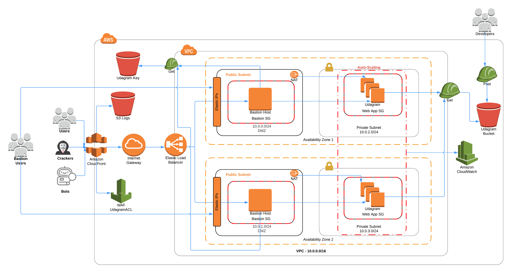

# High-availability application using CloudFormation

## Introduction

This is a [Cloud Formation](https://kubernetes.io/) setup to deploy an Udagram for a highly available app as requirement to Cloud DevOps Nanodegre of [Udacity](https://www.udacity.com/).

## Website Link

Udagram is available under [CloudFront](http://d9tyk1tu3q10q.cloudfront.net).
[http://d9tyk1tu3q10q.cloudfront.net]

## Architecture Diagram

